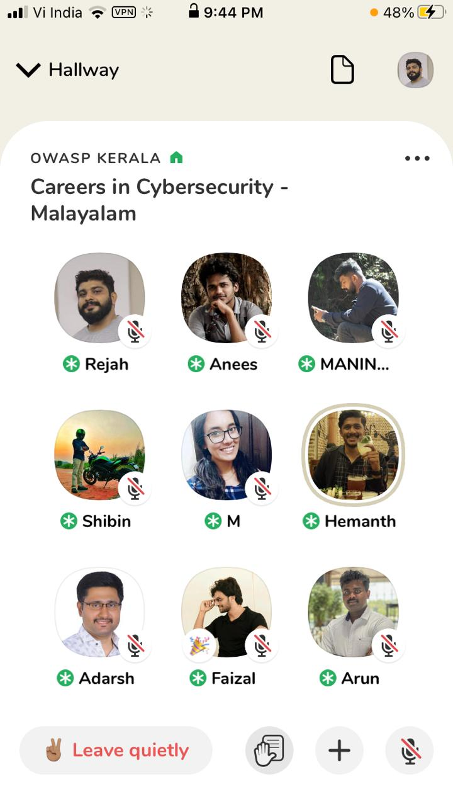

[Home](../index.html)

**Kerala chapter Clubhouse Meet -Careers in Cybersecurity - Malayalam**

[Watch the recorded version here](https://youtu.be/glBz2oZEe6Q)

- Date and time:
    - 9th June 2021 , 8:40PM to 10:40PM IST
- Speaker:
    - Shibin B Shaji, Security Engineer | UST Global,
    - Mohammed Shine, Security Engineer | UST Global,
    - Anil Tom, Security Engineer | UST Global

Discussion regarding various emerging and trending career oppuritunity in Cybersecurity

Relevance of Certification to get placed in Global companies

Dicussion on the public resources for learning new trends and technologies in Cybersecurity. 
