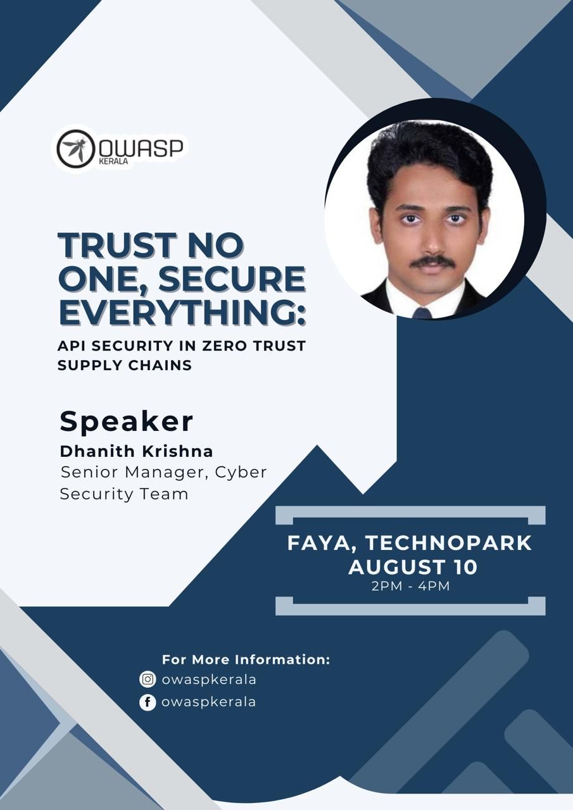
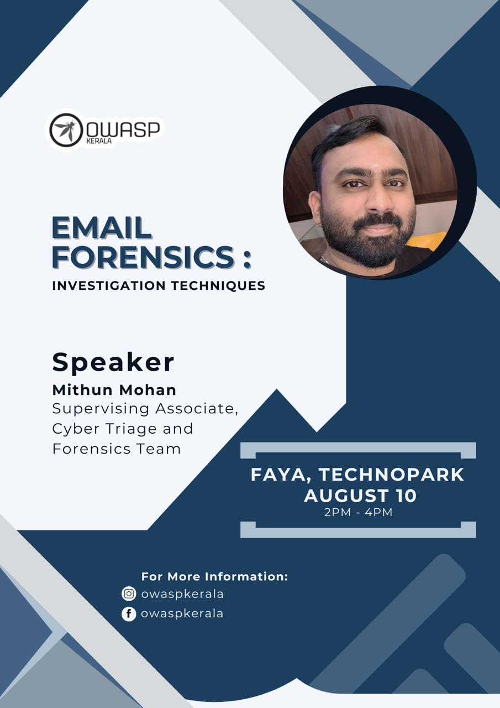

[Home](../index.html)

## **OWASP Kerala - Chapter Meet August 2024**

### Date and time

  10th August. 2024, 2:00 PM to 4:00PM IST

### Venue

  [FAYA, Techno Park, Trivandrum](https://maps.app.goo.gl/HMrvyfCZgZzJLTbL9)

<!-- ### Sponsor  -->

<!-- #### [TinkerHub](https://www.tinkerhub.org/) -->

### Session 1 - Dhanith Krisha  - Trust No One, Secure Everything: API Security in Zero Trust Supply Chains

Dhanith leads Attack & Red Team services for EY Global Delivery Services, leading a global team of 250+ ethical hackers. He is a hardcore practitioner with rich experience working with the world’s leading financial institutions helping them make their digital presence safer. An active member of OWASP, Dhanith has contributed to several open-source information security projects, including the OWASP WSTG. Dhanith is passionate about educating the community on cybersecurity and consistently seeks opportunities to share his knowledge and expertise with the community.

### Session 2 - Midhun Mohan G - Email Forensics: Investigation Techniques

Midhun currently works as Supervising Associate in Cyber Triage & Forensics Team, EY. Has 8 years of experience in Cyber Security & Digital Forensics. Giving back to the community by providing training in his area of expertise is something he is passionate about. Oversaw several training sessions for representatives of the Indian government's agencies, such as the NIA, CBI, Army Security Group, and others. Also contributed in analysis of cyber-crime cases reported by various Law Enforcement Agencies of Government of India and setting up of Digital Forensics Lab.

### [Meet at](https://www.meetup.com/owasp-kerala-chapter/events/302573439/)

### [Recorded](https://www.youtube.com/watch?v=8rJ4IZ6LT-8)
