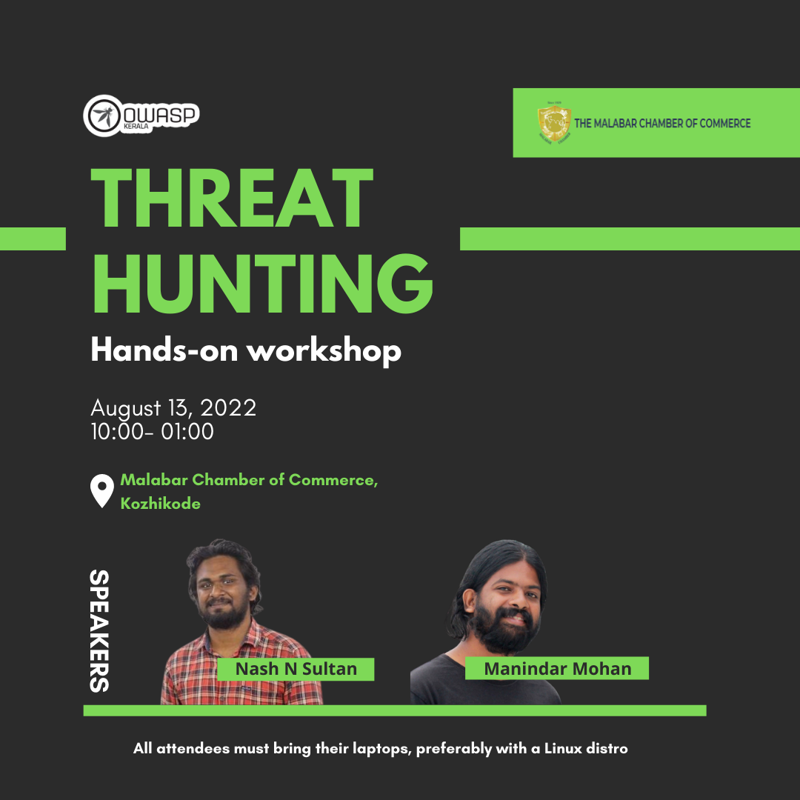

[Home](../index.html)

## **OWASP Kerala - Threat hunting workshop - 13th Aug 2022**

[Meetup](https://www.meetup.com/OWASP-Kerala-Chapter/events/287680524/)

### Date and time

  13th Aug 2022, 10 AM  to 1PM IST

### Venue

  [Malabar Chamber of Commerce, Kozikkode](https://g.page/malabarchamberofcommerce?share)

### Threat Hunting Workshop

The threat hunting workshop helps you achieve a deep understanding of malware, and hands on training on dissecting live malware and performing analysis.

**Speakers: Manindar Mohan and Nash N Sulthan**
Manindar and Nash are both elite members of the Kerala Police Cyberdome and currently employed as senior cyber security engineers at Beagle Security. They both serve on the board of the OWASP Kerala chapter and have more than six years' experience in the cyber security.

### [Register Now](https://www.meetup.com/OWASP-Kerala-Chapter/events/287680524/)
