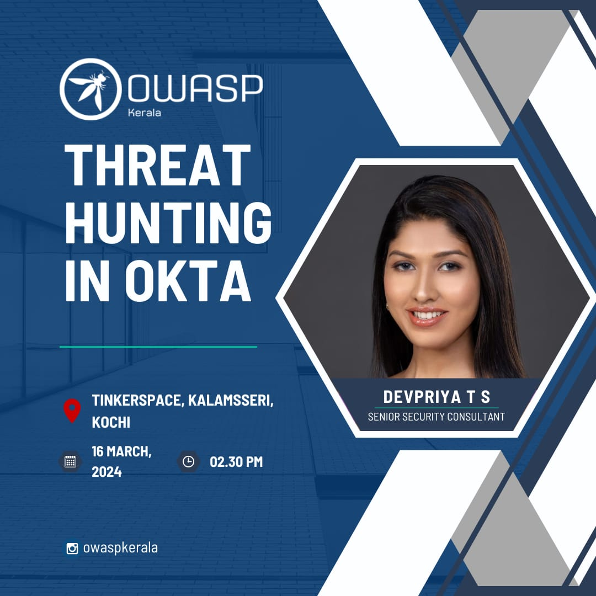
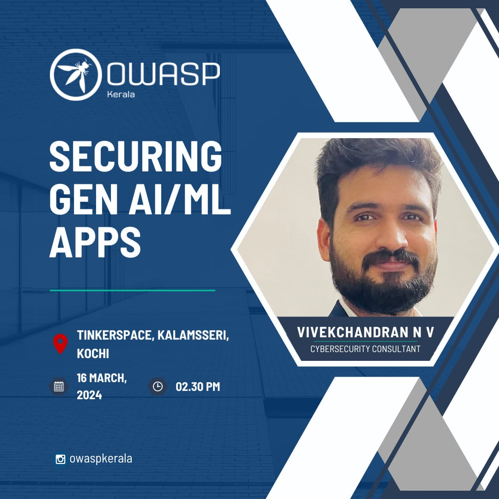

[Home](../index.html)

## **OWASP Kerala - Chapter Meet Mar 2024**

### Date and time

  16th March. 2024, 2:30 PM to 4:30PM IST

### Venue

  [TinkerSpace, Kalamassery, Kochi](https://maps.app.goo.gl/augRjTVxsuAoJUm67)

### Sponsor 

#### [TinkerHub](https://www.tinkerhub.org/)

### Session 1 - Devpriya T S - Threat Hunting in OKTA

Analyzing Okta logs provides vital insights into their structure and event attributes. These insights, coupled with discussions on strategies, can empower Security Operations Centers (SOCs) to effectively address threats within their Identity and Access Management (IAM) environment. Key threats such as account and session hijacking, tenant takeovers, and MFA fatigue can be identified and mitigated through Okta log analysis. It plays a crucial role in detecting and preventing cyber identity threats. 

Devpriya T S , is a Senior Security Consultant at EY with a background as an engineering lead in SOAR. Her expertise encompasses Splunk SOAR, SIEM, and Cortex XSOAR, offering proactive solutions to counter emerging cybersecurity threats.  With a knack for Python programming, she is recognized for significant contributions in automation and application development within the cybersecurity domain. She is dedicated to ensuring the robustness of digital security and staying abreast of emerging threats.

### Session 2 - Vivekchandran N V - Vivekchandran N V

Topic : Securing AI/ML applications 
AI is being integrated more and more into our technologically driven environment in everything from predictive analytics to advacned use cases such as self-driving cars. But as AI systems become more complicated and powerful, they also become more prospective targets for hackers.The security of AI systems must be ensured because any breach could have serious repercussions. Aim of this session is to highlight the importance of securing AI models, exploring the techniques and best practices involved, and advocating for a holistic approach to AI security

Vivekchandran N V is an experienced professional in the field of cyber security. With a degree in M-Tech in Cyber Forensics and Information Security from CUSAT, as well as professional certifications including CEH, ECSA, and CIPM, Vivekchandran has over 9+ years of expertise in the field. He has worked with numerous MNC clients from a variety of industries, including telecom, media, broadcasting, healthcare, finance, and automotive, providing them with valuable insights and solutions for their cyber security requirements. Currently as a freelance security consultant Vive is focused on the cybersecurity requirements for emerging technologies like artificial intelligence and internet of things.

### [Meet at](https://www.meetup.com/owasp-kerala-chapter/events/299725501)

