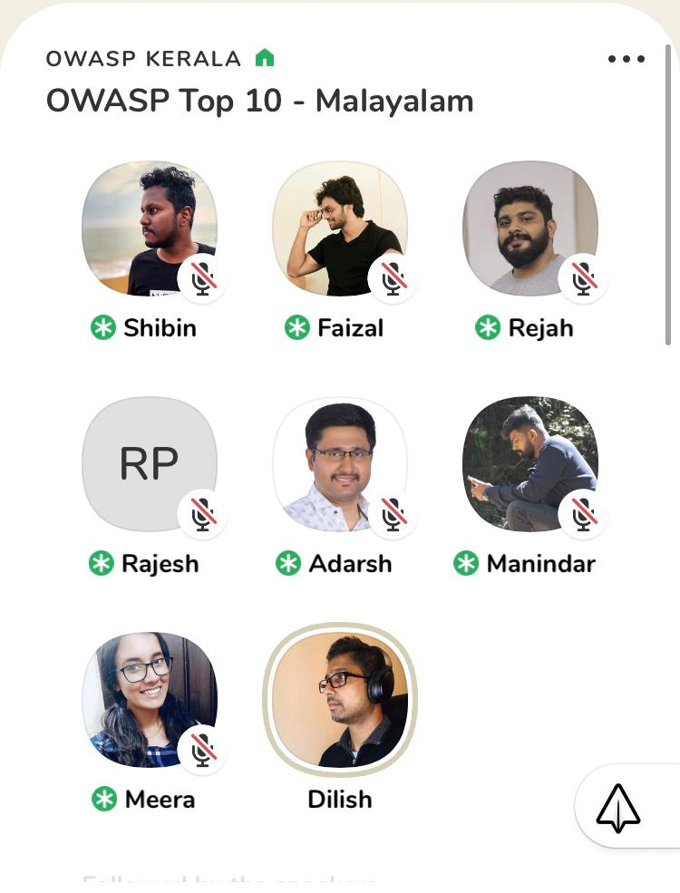

[Home](../index.html)

**Kerala chapter Clubhouse Meet -OWASP Top 10 - Malayalam**

- Date and time:
    - 17th July 2021 , 7:00PM to 08:30PM IST
- Speaker:
    - Adarsh S Nair
    - Rejah Rehim
    - Manieendar Mohan
    - Shibin B Shaji
    - Meera J
    - Faizal Ashruf

Discussion on OWASP Top 10 and how it provides ranking and remediation guidance for the topmost critical web application security risks

Relevance of implementing security in early stages of application development and its 

Conversation on some of the common vulnerabilities, how to exploit and prevent them? and open source tools that can be used to undercover those vulnerabilities.