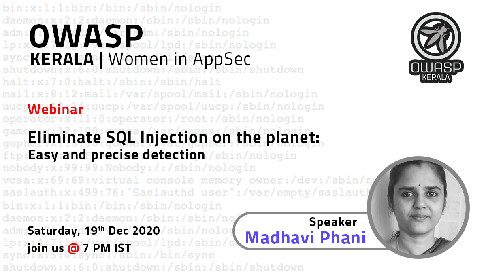

[Home](../index.html)

## **Eliminate SQL Injection on the planet - Easy and precise detection - Webinar**

[Meetup](https://www.meetup.com/OWASP-Kerala-Chapter/events/275206423/)

[Youtube](https://youtu.be/apCed4qe3-8)

### Date and time

  19 Dec 2020, Saturday at 7 PM IST

### Speakers

- Phani Madhavi Chivukula , Associate Director

Phani Madhavi is an Associate Director in a leading MNC and has two-plus decades of experience in developing computer/web applications.
She is extremely passionate about building robust enterprise applications - with a specific focus on software security.
She has received an Award of Excellence for her work.
She has a thorough grasp of OWASP recommendations for web security.
She has a thorough understanding of the business processes and has suggested innovative solutions applicable at each stage of web application development lifecycle.
She also has managed teams of size ~250+ and has extensive exposure to guiding and training teams.

### Abstract

SQL injection holds a special place in OWASP Top10.The impact of SQL injection is that the source of truth of the business data can get corrupted, deleted , stolen, all of which are highly detrimental to the successful running of the business. We all need to get together for a common goal to eliminate SQL injection from the planet. So, what does it take to do this?

Yes we all know that to mitigate we have to parameterize the data - but how to quickly check if the code still has vulnerable queries. This talk emphasizes how IT technical team inclusive of technically inclined managers can play their part and precisely identify the vulnerabilities in an easy fashion during review. An automated solution could be developed once the review attains a certain maturity.

The talk also explains all types of SQL injections from the point of injection to how it presents itself at the database and how each type of injection can be detected.
