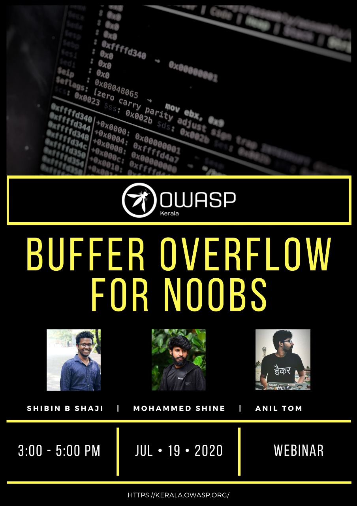

[Home](../index.html)

**Kerala chapter Meet - Buffer Overflow for Noobs - Webinar**

- Date and time:
    - 19th July 2020 , 3PM to 5PM IST
- Speaker:
    - Shibin B Shaji, Security Engineer | UST Global,
    - Mohammed Shine, Security Engineer | UST Global,
    - Anil Tom, Security Engineer | UST Global

Buffer-overflow is one of the most commonly occuring type of vulnerability, but the concept is still vague.

The session is aimed at complete beginners and will focus on some basics of Assembly language followed by a demonstration of buffer-overflow in a C-program.

We will be analyzing each step of the compilation using GDB to visualize how the stack responds to different types of inputs and how larger values trigger  a buffer-overflow.

You needn't have prior knowledge in any aspect of cyber security to explore this topic!