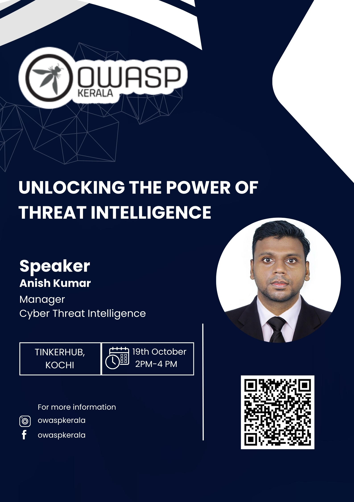
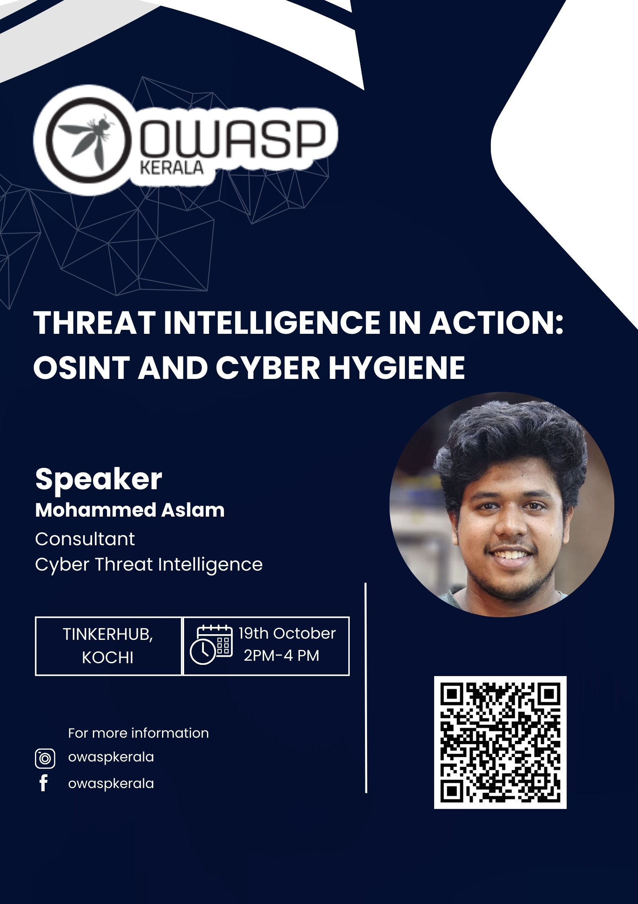

[Home](../index.html)

## **OWASP Kerala - Chapter Meet Oct 2024**

### Date and time

  19th October. 2024, 2:00 PM to 4:00PM IST

### Venue

  [TinkerSpace, Kalamassery, Kochi](https://maps.app.goo.gl/augRjTVxsuAoJUm67)

### Sponsor 

#### [TinkerHub](https://www.tinkerhub.org/)

### Session 1 - Anish Kumar - Unlocking the Power of Threat Intelligence

Anish is a dedicated and passionate cybersecurity expert, leading the global delivery of Cyber Threat Intelligence services, providing tailored intelligence solutions to multiple sectors including finance, healthcare, and critical infrastructure. His expertise extends to managing supplier risk, where he help organizations identify, assess, and mitigate risks in their supply chains, ensuring robust defense mechanisms against potential vulnerabilities.
In addition to his professional achievements, he is committed to educating the broader cybersecurity community. He actively seek opportunities to share the knowledge, helping organizations and individuals stay informed on evolving threats and best practices.

### Session 2 - Mohammed Aslam - Threat Intelligence in Action: OSINT and Cyber Hygiene

 
Mohammed Aslam is a Cyber Threat Intelligence Consultant at overseeing a team responsible for delivering tailored threat intelligence solutions. With expertise in OSINT, dark web monitoring, and automation, he focuses on enhancing cybersecurity operations and mitigating risks for global clients. Aslam is committed to developing practical, effective solutions that strengthen organizational defenses and improve response to emerging threats.

### [Meet at](https://www.meetup.com/owasp-kerala-chapter/events/303954172/)

