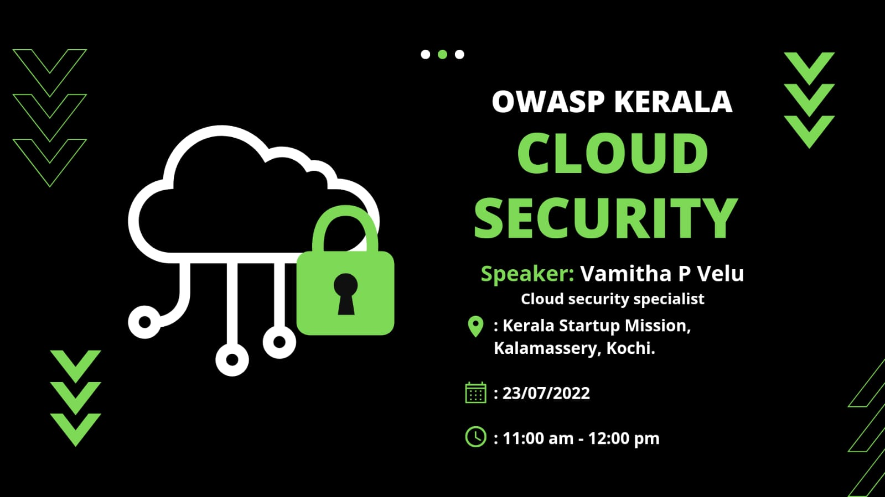
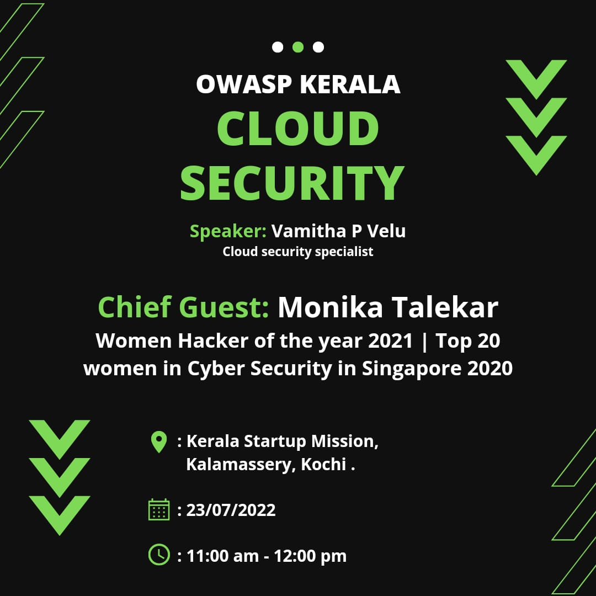

[Home](../index.html)

## **OWASP Kerala - Cloud Security - 23rd July 2022**

[Meetup](https://www.meetup.com/OWASP-Kerala-Chapter/events/287209863/)

### Date and time

  23rd July 2022, 11 AM  to 12PM IST

### Cloud Security

Vulnerabilities in the cloud in the light of recent cloud attacks with the rising need for enhancing cloud security.

**Speaker: Vamitha, Cloud security specialist, Nokia**
Currently working as the Cloud Security Specialist at Nokia™️ with three-year expertise in and around the related field. An active member of various security communities including DEFCON and WICS.

### [Register Now](https://www.meetup.com/OWASP-Kerala-Chapter/events/287209863/)
