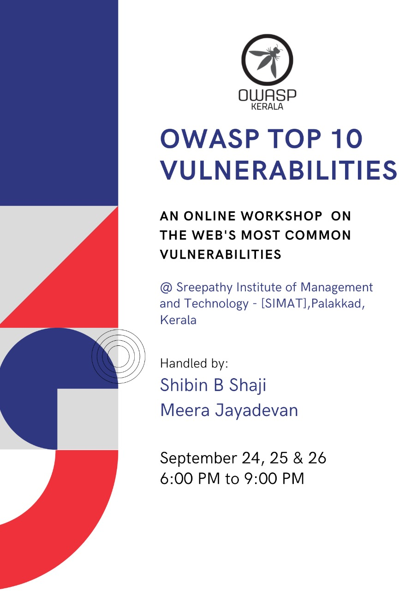

[Home](../index.html)

## **OWASP TOP 10 Vulnerabilities - 3 Day Workshop 2021**

[Meetup](https://www.meetup.com/OWASP-Kerala-Chapter/events/280962503/)

### Date and time

  24,25 & 26 Sep 2021, 7 PM  to 9PM IST

### Speakers

- Shibin B Shaji
  Shibin is a Security Engineer who is mostly interested to dig deeper into codes. He has received acknowledgements from companies like Apple, Zoom, Oppo, OnePlus etc. His area of expertise is web application, mobile application, APIs and Reverse Engineering.
- Meera Jayadevan
  Meera is an Information security professional with 5+ years of industry experience. She is a member of the OWASP kerala and also a lead of the Women in Appsec Kerala chapter (a budding infosec chapter). She was also a part of the organizing team of HacKP 2021 ( International hackathon initiative by Kerala Police Cyberdome).
### Abstract

OWASP TOP 10 Vulnerabilities - 3 Day Workshop