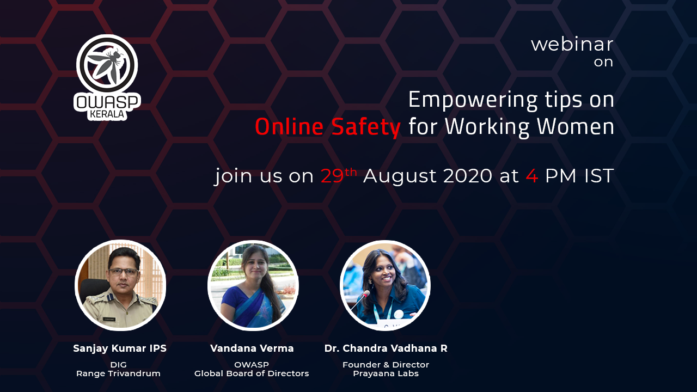

[Home](../index.html)

## **Empowering tips on Online Safety for Working Women - Webinar**

[Meetup](https://www.meetup.com/OWASP-Kerala-Chapter/events/272782436/)

[Youtube](https://www.youtube.com/watch?v=3B1cxtxJLgw)

### Date and time

  29th Aug 2020 , 4PM to 6PM IST

### Speakers

- Sanjay Kumar IPS, DIG Range Trivandrum
- Vandana Verma, OWASP Global Board of Directors
- Dr. Chandra Vadhana R, Founder & Director Prayaana Labs

#### About Speakers

##### Shri. Sanjay Kumar Gurudin IPS

Shri. Sanjay Kumar Gurudin IPS are the Dy. Inspector General of Police, Trivandrum Range, Kerala. He is an expert cybersecurity analyst and specializes in the investigation of Cyber Crimes, especially online crimes affecting Children. He has authored the book " IS YOUR CHILD SAFE?“ related to online abuses affecting Children, which has been published in many languages.

##### Ms. Vandana Verma

Ms. Vandana Verma is a seasoned security professional with over a decade worth of experience ranging from application security to infrastructure and now dealing with DevSecOps. She is currently a part of the Global Board of Directors, OWASP Foundation. She is a speaker at various National and International conferences and works with multiple communities like InfosecGirls, OWASP, null, etc. Her passion is to increase female participation in Infosec space.

##### Dr. Chandra Vadhana R

Dr. Chandra Vadhana is a Social Entrepreneur, Coach, Academician, Author, and is the founder and director of Prayaana Labs. She is the Winner of UNCTAD Women in Business Award 2018- Special recognition for Social Enterprise and also the winner of High Impact Entrepreneur from Emerging Regions for Action (HIEERA) award by Empretec India. She is one among the 25 Woman Changemakers from India selected for TechCamp by US Govt in 2018 and also is an IVLP Fellow of US Department of State (2019).

### Abstract

Cybercriminals are lurking around the cyberspace. Different types of crimes are being committed,  especially against  women, such as cyberbullying, cyber stalking,  blackmailing, online harrassment etc  in this digital era.
 Listen to this webinar to understand what are the various  online crimes taking place against women,  and ways to keep yourself safe, and how to respond in case you are victimised.
