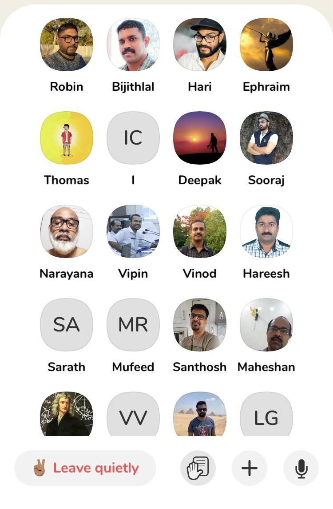

[Home](../index.html)

**Kerala chapter Clubhouse Meet - Financial Fraud and Prevention - Malayalam**

- Date and time:
    - 29th June 2021 , 7:00PM to 09:00PM IST
- Speaker:
    - Rejah Rehim
    - Anees Muhammed
    - Nash N sulthan 
    - Manindar Mohan
    - Meera J
    - Anand V S

Discussion regarding financial fraud in Kerala and how to prevent it.

In this session we discussed about the common mistakes users tend to make, common methodologies used by fraudsters and how to deliver awareness to the common people.

More than hundred participants were present for the event and participants have requested for more awareness programs like this.