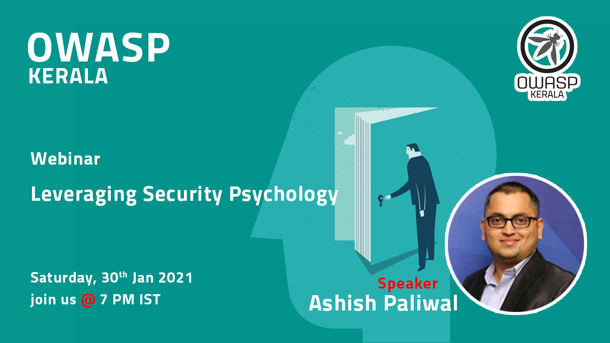

[Home](../index.html)

[Meetup](https://www.meetup.com/OWASP-Kerala-Chapter/events/275931261/)

[Youtube](https://youtu.be/RD5keEUsRgY)

### Date and time

  30 Jan 2021, Saturday at 7 PM IST

### Speakers

- [Ashish Paliwal, Information Security Officer](https://www.linkedin.com/in/ashishrpaliwal/)

### Abstract

Human risk is real, and information and cybersecurity awareness trainings are NOT assuring and adequate. In this webinar, I intend to touch upon, with walk-through, of an attempt to draw and pre-empt assurances with a subjective yet out-of-box proposition to influence and get-influenced while not-endorsing in entirety the myopic compliance-focused de-facto industry approach.