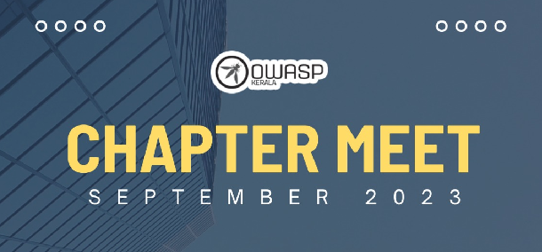
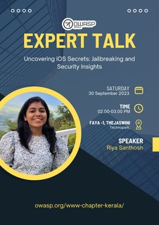
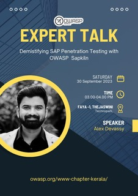

[Home](../index.html)

## **OWASP Kerala - Chapter Meet Sep 2023**

### Date and time

  30th Sept. 2023, 2 PM to 4PM IST

### Venue

  [Faya, L13-B1, Thejaswini, Technopark Campus](https://maps.app.goo.gl/CemQQtfZiER8e4hS6)

### Session 1 - Riya Santhosh - Uncovering iOS secrets: jailbreaking and security insights

Riya Santhosh is a Cyber Enthusiast and Seasoned Professional with 7 years of global industry expertise, known for driving business growth strategies through expert penetration testing. Well versed on web, infrastructure, mobile, thick client, infrastructure penetration testing.Spearheading and securing businesses across the US and APAC regions, Riya combines cutting-edge cybersecurity knowledge with a passion for safeguarding digital landscapes and innovating for a safer tomorrow.

### Session 2 - Alex Devassy - Demistifying SAP penetration testing with owasp sapkiln

Alex Neelankavil Devassy is a seasoned Cyber Security Consultant with over 5 years of extensive experience in penetration testing, security consultancy, and cyber security training. With a strong background in conducting security assessments, Alex specializes in penetration testing of various systems, including commercial off-the-shelf Web Applications, Network, Mobile, and Thick client applications. With a focus on emerging technologies, Alex is dedicated to developing methodologies, tools, presentations, and learning materials for security assessments of Blockchain and SAP systems. His expertise extends to automating pen testing activities using Azure Serverless modules, PowerShell, Nodejs, Docker, and other cutting-edge technologies. Alex's achievements include co-authoring the chapter "Safeguarding Blockchains from Adversarial Tactics" in the book "Blockchain for Industry 4.0: Emergence, Challenges, and Opportunities."' He had also shared his knowledge as a speaker at hacking and cyber security conference cocon 15th, where they delved into the topic of "Hyperledger Fabric & Ethereum Apps: Security Deep Dive." Additionally, Alex has delivered talks on "Blockchain Security" at OWASP Tunisia and Kerala chapters.

### [Meet at](https://www.meetup.com/owasp-kerala-chapter/events/296310744/)