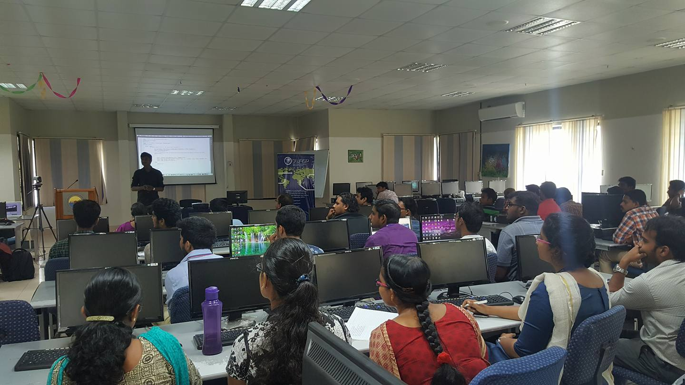
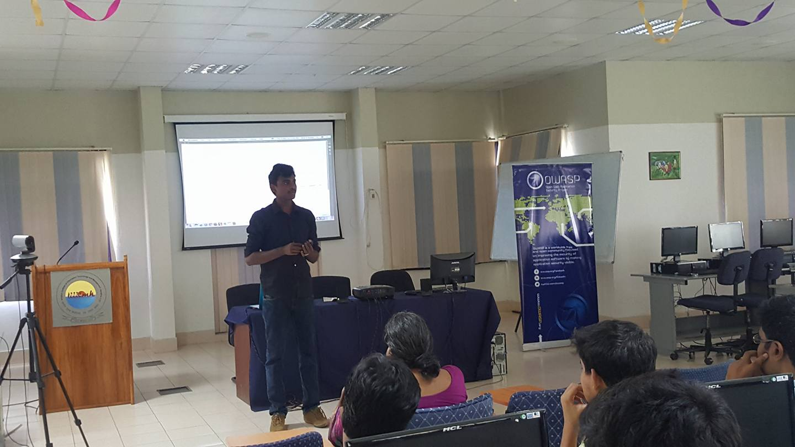

[Home](../index.html)

## OWASP Kerala Chapter Meet November 2016

**Venue**

   Central Computing Facility [CCF], 3rd Floor, IIITM-K, Technopark Campus, Trivandrum

**Date & Time**

   November 3rd 2016

**Event Sponser**

   IIITM-K, Technopark Campus, Trivandrum

**Agenda**

   * 2.00 pm to 2:10 pm - Welcome

   * 2:10 pm to 3:00 pm - Facebook Page Takeover – Zero Day Vulnerability
   Speaker: Arun SureshKumar - Bug Bounty Hunter

   * 3:10 pm to 4:00 pm - Trojan Exploiting
   Speaker: Anwar Sha - Information Security Specialist

   * 4:00 pm to 4:50 pm - Secure Coding Practices in .NET M
   Speaker: Rajesh P - Information Security Specialist

**Topics**

**Facebook Page Takeover** – Zero Day Vulnerability

   * Discussion on latest Facebook Page Takeover – Zero Day Vulnerability

**Trojan Exploiting**

   * working of trojan

   * Different type of trojans

   * how to setup trojans

   * working of trojans (android,windows etc)

   * Trojans removers and findings

**Secure Coding Practices in .NET MVC**

   * Security Policies

   * Data Annotations

   * .Net Identity Basics

   * Introduction to DPAPI

   * Secret Manager

**Event gallery**
 
 

   
   
 
 

