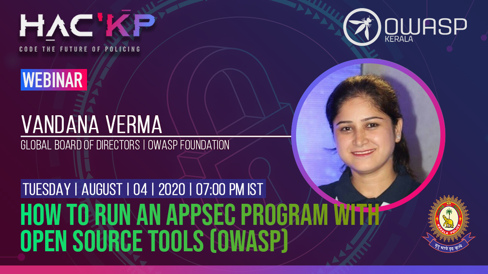

[Home](../index.html)

**How to run an Appsec program with open source tools (OWASP)**

[Meetup](https://www.meetup.com/OWASP-Kerala-Chapter/events/272352279/)

[Youtube](https://www.youtube.com/watch?v=xB_qcCPsznA)

- Date and time:
    - 4th Aug 2020 , 7PM to 9PM IST
- Speaker:
    - Name: Ms. Vandana Verma, Global Board of Directors, OWASP Foundation

**Speaker Profile:** Vandana is a seasoned security professional with experience ranging from application security to infrastructure and now dealing with DevSecOps. She has been Keynote speaker / Speaker / Trainer at various public events ranging from Global OWASP AppSec events to BlackHat events to regional events like BSides events in India.
She is part of the OWASP Global board of directors. She also works in various community towards diversity initiatives InfosecGirls, WoSec and null.

She has been recipient of multiple prestigious awards like  Global cybersecurity influencer among IFSEC Global's "Top Influencers in Security and Fire" Category for 2019, Cybersecurity Women of the year award by Women Cyberjutsu Society in the Category “Secure Coder”. She has also been listed as one of the top women leaders in this field of technology and cybersecurity in India by Instasafe.

**Abstract:** Data is considered as the new oil, and it is highly required to ensure data security at any point in time. Application security is crucial to ensure the security of data. Listen to this #webinar to understand various tools and techniques that can assist in ensuring data security.