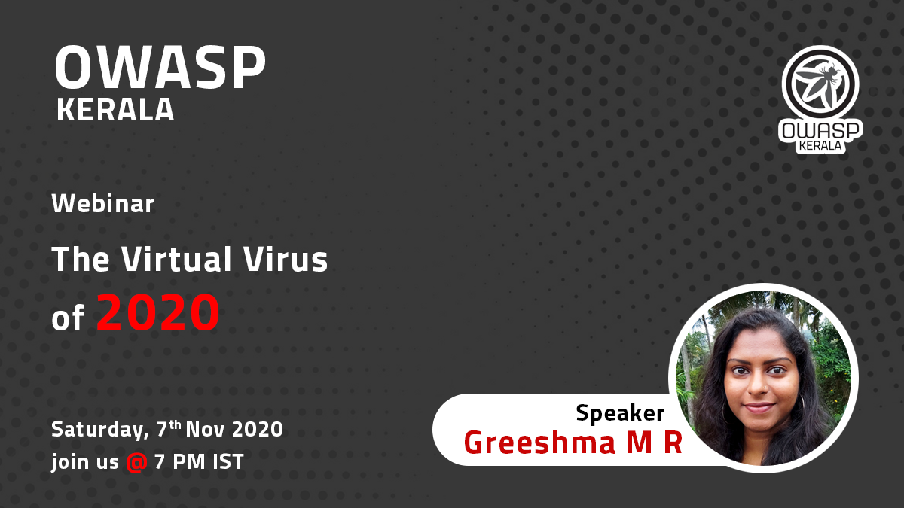

[Home](../index.html)

## **The Virtual Virus of 2020 - Webinar**

[Meetup](https://www.meetup.com/OWASP-Kerala-Chapter/events/274252100/)

[Youtube](https://youtu.be/wRgAv9HRJXI)

### Date and time

  07 Nov 2020, Saturday at 7 PM IST

### Speakers

- Greeshma M R
  Co-author - "The Infodemic: Infomania, Social Engineering and the Pandemic - Break the Chain"

### Abstract

The year 2020 was a time of online interaction at its peak. As the infomania for covid 19 skyrocketed, so did the fake news and crisis capitalisation using social engineering strategies.
