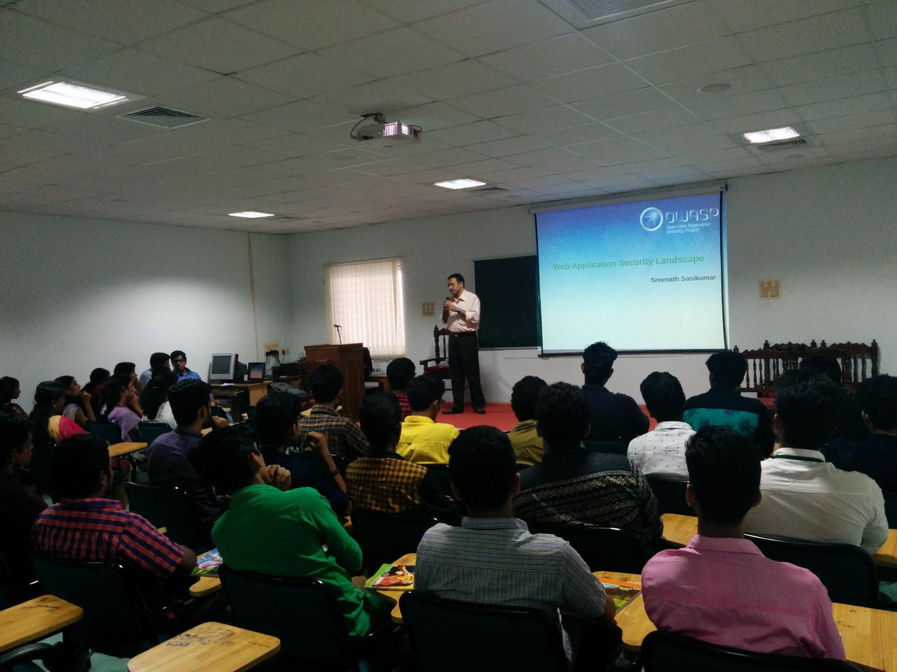
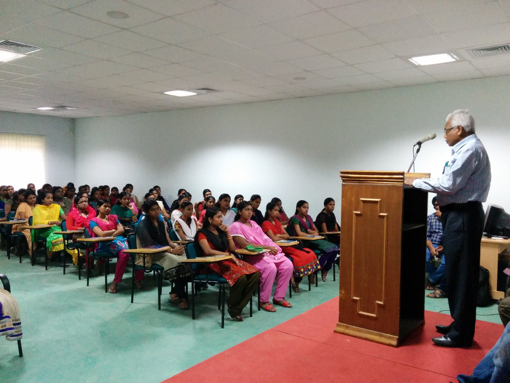
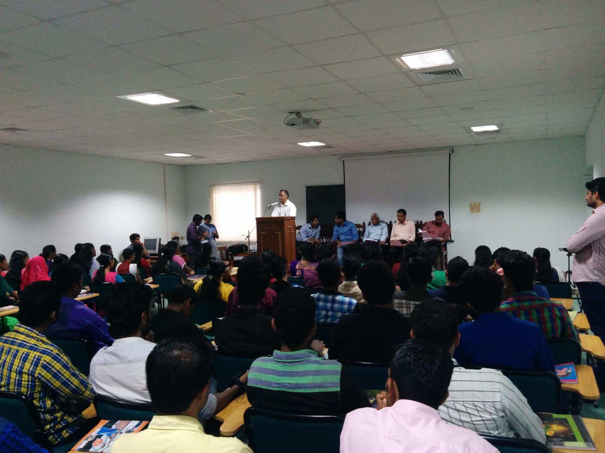
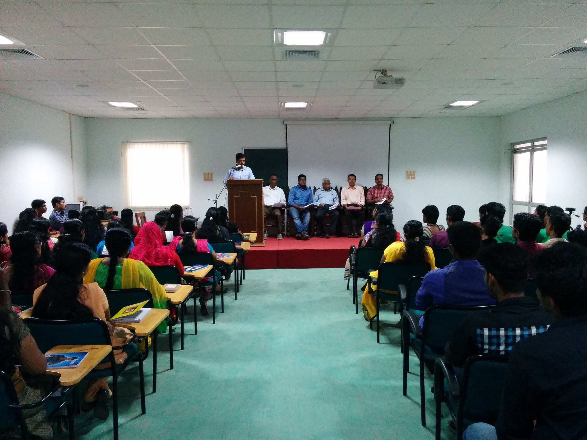
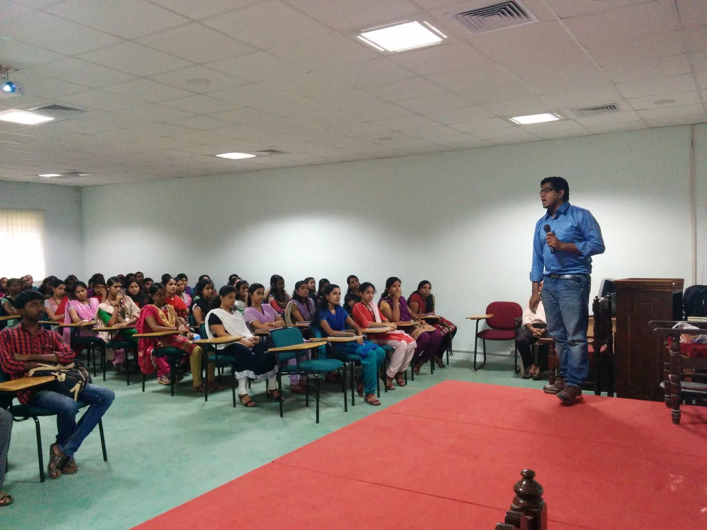
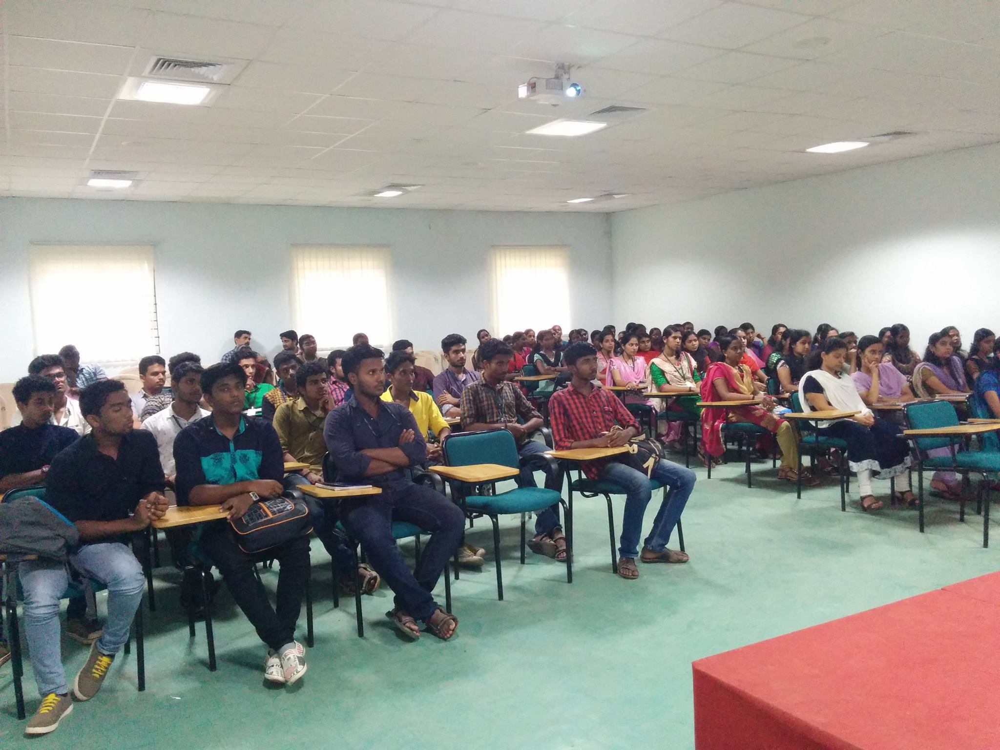

[Home](../index.html)

##  OWASP @ 2016: Building a Secure Internet (Student outreach initiative) @ Sarabhai Institute of Science and Technology, Uriyacode, Vellanad, Trivandrum

 **Venue**

   Sarabhai Institute of Science and Technology, Uriyacode, Vellanad, Trivandrum

**Date & Time**

   February 26th 2016 (10:00 AM to 1:00 PM )

**Event Sponser**

   Sarabhai Institute of Science and Technology, Uriyacode, Vellanad, Trivandrum

**Agenda**

   * 10:00 am to 10:50 pm - Web Application Security Landscape
        
   Speaker:Sreenath Sasikumar -Information Security Consultant
    
   * 10:50 pm to 11:30 pm - OWASP Top 10 Vulnerabilities
        
   Speaker:Rajesh P - Technical Consultant

**Event Gallery**

	
	
	
	   
	  
	  

 
