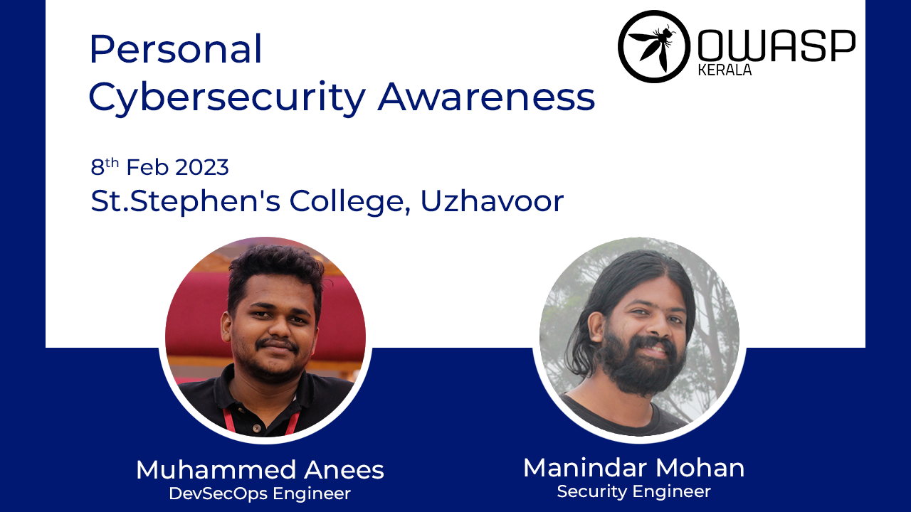

[Home](../index.html)

## **OWASP Kerala - Personal Cybersecurity Awareness - 8th Feb 2023**

### Date and time

  8th Feb 2023, 2 PM to 4PM IST

### Venue

  [St. Stephen's College, Uzhavoor](https://goo.gl/maps/cge6M2VvPDeoQF6m6)

### Personal Cybersecurity Awareness

Personal Cybersecurity Awareness event to learn about the latest threats and how to safeguard your online identity. From password management to social media safety, practical tips and advice to help you secure your personal information.

**Speakers: Manindar Mohan and Muhammed Anees**
Manindar and Anees are both elite members of the Kerala Police Cyberdome and currently employed as senior security engineers at Beagle Security. They both serve on the board of the OWASP Kerala chapter and have more than six years' experience in the cyber security.
