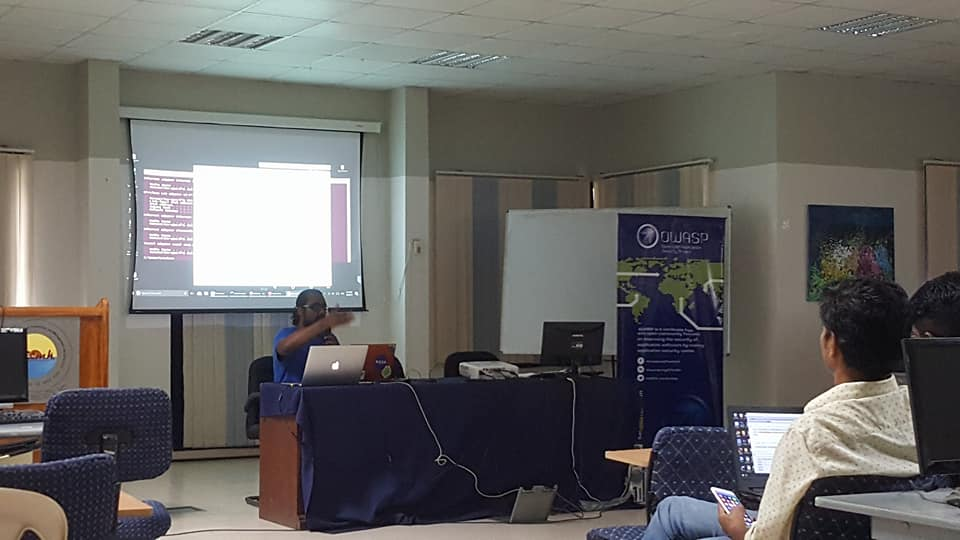
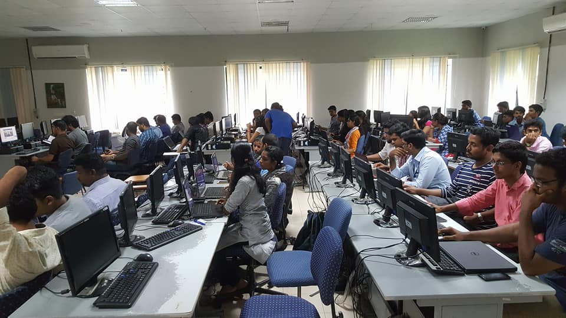
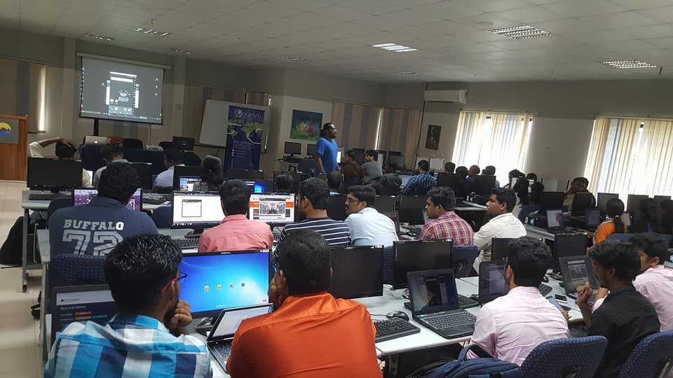
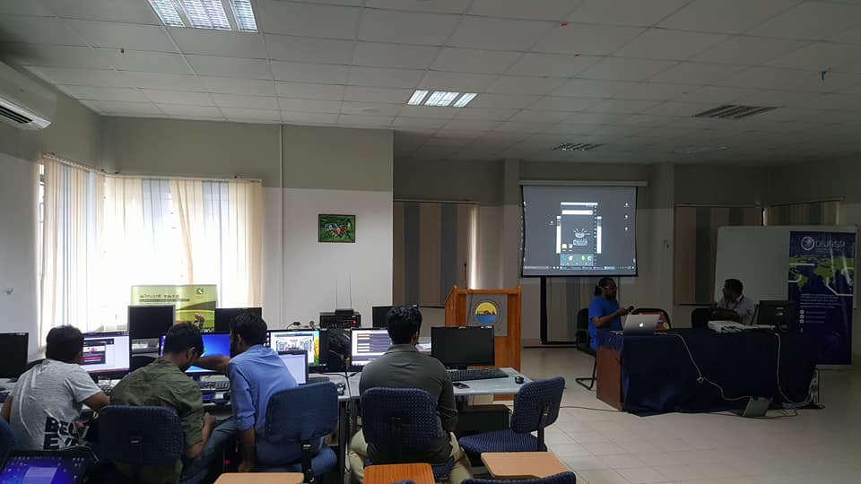

<a href="../index.html" class="previous">&laquo; Home</a>

### OWASP Kerala Workshop on Android Pen testing, September 2017

Being the Operating System with the largest user-base, the threat landscape for Android applications cannot often be ignored. While Android OS is being used in a wide variety of devices from smart watches to TVs, a large chunk of its user-base is concentrated to mobile phones. Popular services which were offered over web are also trying constantly to adapt themselves for the mobile environment. This raises a few important questions to Information Security enthusiasts.

How similar or how different are the threats related to Android applications?

How can we perform penetration tests on an Android application?

The workshop would cover the basic threat model for android applications and would provide a quick guide to perform penetration tests on android applications detailing how we can intercept android traffic and reverse engineer the application package.

**Venue**

   Central Computing Facility [CCF], 3rd Floor, IIITM-K, Technopark Campus, Trivandrum

**Date & Time**

   September 8th 2017 @ 2:30 PM

**Event Sponsor**

   IIITM-K, Technopark Campus, Trivandrum

**Speaker:**

Roshan Thomas, Information Security Consultant at MassMutual Financial Group. Student at Northeastern University, Boston, Massachusetts

Info-security enthusiast, student, pen-tester and a consultant based out of Boston, Massachusetts.

**Topic Covered:**

   1. Basic threat model for android applications
   2. Guide to perform penetration tests on android applications
   3. Reverse engineer the application package

## Registration    

[Register Here](https://www.eventbrite.com/e/workshop-on-android-application-penetration-testing-tickets-37384870153) 

**Event gallery**

	
	
	
	

 
