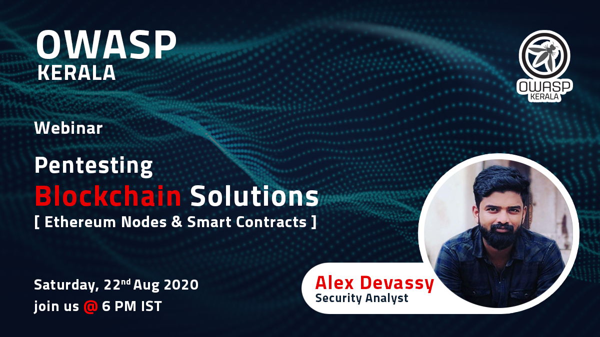

OWASP Kerala Chapter was founded in the mid of 2006 by a group of security enthusiasts and professionals who predominantly conducts events like Seminars on Cloud Security, Social Engineering, Cyber Laws, Mobile Vulnerabilities etc. to create awareness related to software security in the society. The chapter presents opportunities to the software community in contributing to secure application development.

OWASP provides speakers to Institution of Engineers for Wednesday technical talks related to application security they organize. OWASP also provides speakers to Computer Society of India for technical sessions related to application security they organize.

## Speakers

Would you like to speak on the upcoming OWASP Kerala AppSec Conference?

### Call for Papers (CFP) is NOW OPEN

Web Applications Security Leaders, Software Engineers, Security Enthusiasts and Researchers from all over the world are invited to be a part of the conference for the visibility and evolution in the safety and security of the world’s software.

Please submit your Profile and the paper abstract via email to <strong>[OWASP CFP](mailto:owaspcfp@gmail.com).</strong>

### Local News

OWASP Kerala is organizing a one day conference on Application Security on 01-Dec-2018. We are inviting papers on Application Security for the conference. Please watch this space for more details.

### Upcoming Event

- Aug 22th 2020, 6PM IST

[Kerala chapter Meet - Pen testing Blockchain Solutions (Ethereum Nodes & Smart Contracts) - Webinar](events/22-aug-2020.md)