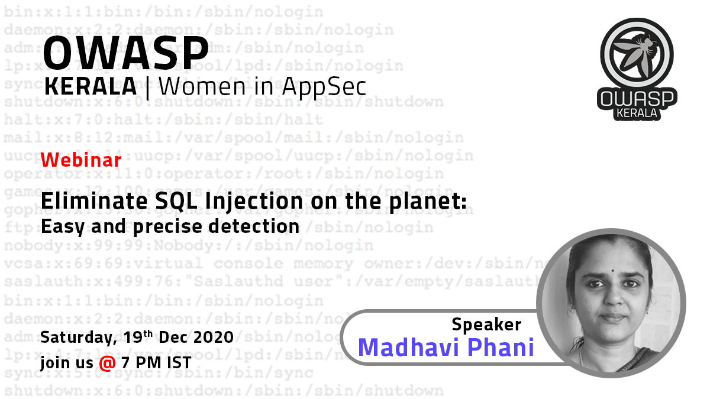

OWASP Kerala Chapter was founded in the mid of 2006 by a group of security enthusiasts and professionals who predominantly conducts events like Seminars on Cloud Security, Social Engineering, Cyber Laws, Mobile Vulnerabilities etc. to create awareness related to software security in the society. The chapter presents opportunities to the software community in contributing to secure application development.

OWASP provides speakers to Institution of Engineers for Wednesday technical talks related to application security they organize. OWASP also provides speakers to Computer Society of India for technical sessions related to application security they organize.

## Speakers

Would you like to speak on the upcoming OWASP Kerala AppSec Conference?

### Call for Papers (CFP) is NOW OPEN

Web Applications Security Leaders, Software Engineers, Security Enthusiasts and Researchers from all over the world are invited to be a part of the conference for the visibility and evolution in the safety and security of the world’s software.

Please submit your Profile and the paper abstract here **[OWASP CFP](https://forms.gle/9HaieZZiHHKKKQzQ7)**.

### Local News

### Upcoming Event

#### December 19th 2020

- [Eliminate SQL Injection on the planet - Easy and precise detection](events/19-dec-2020)

